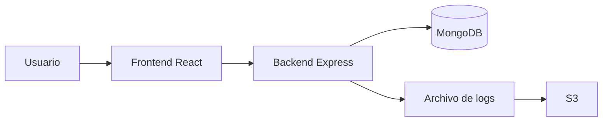

# Reporte del Proyecto

## Introduccion

### Descripcion de la aplicacion

CryptoTracker es una aplicacion web que consulta informacion del mercado de criptomonedas desde una API externa y almacena el historial de consultas en MongoDB. La solucion fue disenada para demostrar el ciclo de vida completo de una aplicacion dentro de un enfoque DevOps.

### Justificacion del desarrollo

Se eligio un tracker de criptomonedas porque permite integrar frontend, backend, consumo de API externa, persistencia de datos, logs y despliegue reproducible con Docker y AWS.

## Desarrollo

### Tecnologias utilizadas

- React para la interfaz de usuario
- Node.js y Express para el backend
- MongoDB para persistencia
- Docker y Docker Compose para contenerizacion
- Bash para automatizacion
- AWS EC2, S3 y CloudFormation para despliegue

### Arquitectura

## Implementacion

### Pasos de ejecucion local

1. Abrir una terminal en la raiz del proyecto.
2. Ejecutar `docker compose build`.
3. Ejecutar `docker compose up -d`.
4. Abrir `http://localhost`.
5. Revisar `logs/app.log`.

### Pasos en EC2

1. Crear la infraestructura con CloudFormation.
2. Conectarse a la instancia EC2 por SSH.
3. Instalar Git, Docker y Docker Compose.
4. Clonar el repositorio.
5. Ejecutar `chmod +x deploy.sh start_app.sh stop_app.sh`.
6. Ejecutar `./deploy.sh`.
7. Acceder a `http://IP_PUBLICA_EC2`.

## Evidencias

Incluye aqui:

- Captura del frontend corriendo en localhost
- Captura de `docker compose ps`
- Captura del archivo `logs/app.log`
- Captura del bucket S3
- Captura del stack en CloudFormation
- Captura de la aplicacion abierta desde EC2

## Problemas encontrados

### Retos tecnicos

- Ajustar la comunicacion entre frontend, backend y MongoDB dentro de Docker.
- Corregir rutas de logs para que persistieran fuera del contenedor.
- Preparar una variable de entorno para que el frontend consumiera el backend correcto en EC2.
- Documentar correctamente los puertos y la apertura necesaria en Security Groups.

## Reflexion

### Que fue lo mas dificil

La parte mas delicada fue hacer que la misma aplicacion funcionara correctamente tanto en local como en una instancia EC2, manteniendo consistencia en puertos, rutas y automatizacion.

### Que mejoraria

Agregaria pipeline CI/CD, pruebas automaticas, despliegue continuo y respaldo automatizado de logs a S3.

### Que cambiaria en produccion

No expondria puertos de forma abierta, moveria secretos a un gestor seguro, agregaria HTTPS, balanceador, monitoreo y una base de datos administrada.

## Preguntas de reflexion

### Por que es importante Docker en DevOps

Docker permite empaquetar la aplicacion con sus dependencias para ejecutarla de forma consistente en distintos entornos, reduciendo errores de configuracion y acelerando despliegues.

### Que ventajas ofrece CloudFormation

CloudFormation permite definir infraestructura como codigo, repetir despliegues, versionar cambios y reducir configuraciones manuales.

### Por que no es recomendable usar 0.0.0.0/0 en produccion

Porque abre el acceso a cualquier direccion IP del mundo y aumenta la superficie de ataque. En produccion se deben aplicar reglas mas restrictivas y seguras.

### Que automatizarias en un siguiente nivel

Automatizaria pruebas, build de imagenes, despliegues a AWS, respaldos de logs a S3, monitoreo y alertas.
